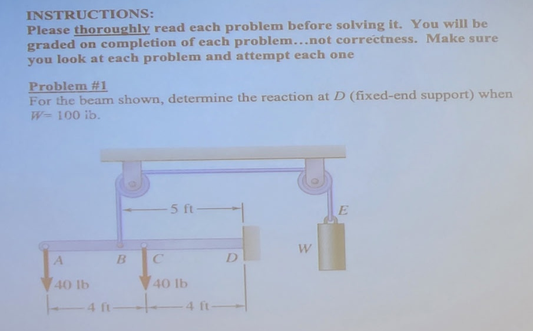
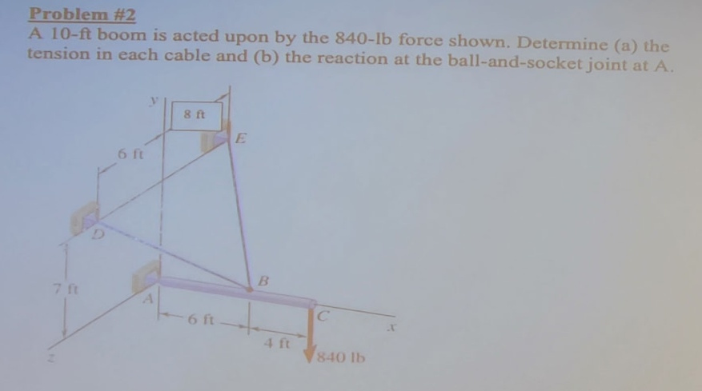
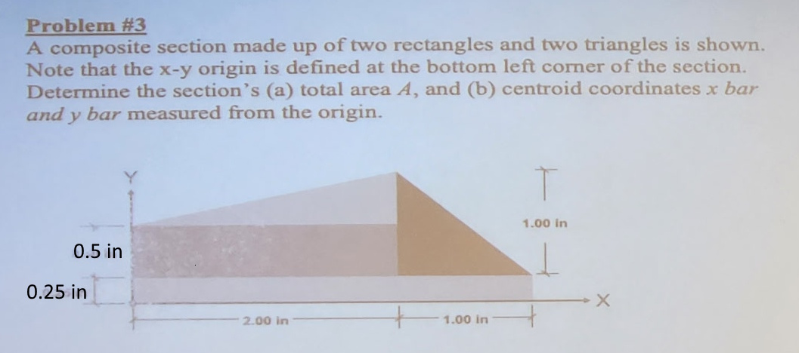
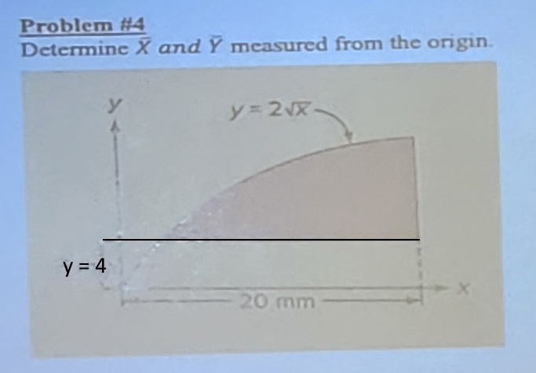
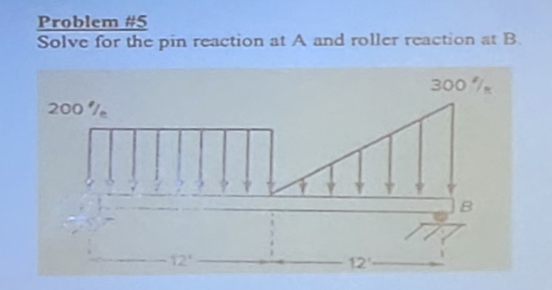
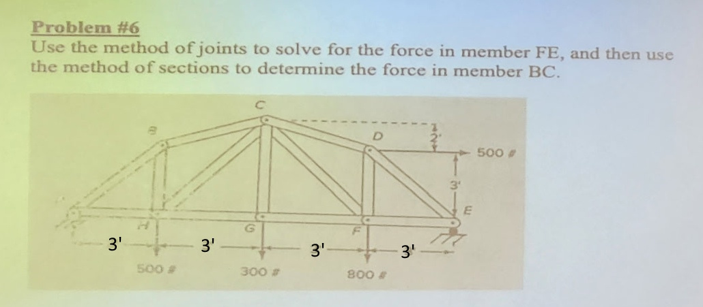

# CE 333 Statics - Test 2 (A) - ANSWER KEY

---

## Problem #1 (10 points)

For the beam shown, determine the reaction at D (fixed-end support) when $W = 100\,\mathrm{lb}$.

### Answer
$V_D = -20\,\mathrm{lb}$ (downward), $M_D = -120\,\mathrm{lb\cdot ft}$ (clockwise), $H_D = 0$

### Solution

**Given:** Beam A-C-D with total length 8 ft. Loads: 40 lb at A, 40 lb at C. Pulley at B (midway between A and C) applies $W = 100\,\mathrm{lb}$ upward. Fixed support at D.

**Vertical force equilibrium:**

$$\sum F_y = 0: V_D + 100 - 40 - 40 = 0$$

$$V_D = -20\,\mathrm{lb}$$

Negative indicates downward reaction.

**Horizontal force equilibrium:**

$$\sum F_x = 0: H_D = 0$$

**Moment equilibrium about D:**

$$\sum M_D = 0: M_D + 100(6) - 40(8) - 40(4) = 0$$

$$M_D = -600 + 320 + 160 = -120\,\mathrm{lb\cdot ft}$$

---

## Problem #2 (15 points)

A 10-ft boom is acted upon by the $840\,\mathrm{lb}$ force shown. Determine  
(a) the tension in each cable and  
(b) the reaction at the ball-and-socket joint at A.

### Answer
(a) $T_{BD} = 1{,}257\,\mathrm{lb}$, $T_{BE} = 1{,}046\,\mathrm{lb}$; (b) $\vec{R}_A = (1{,}200\hat{i} - 560\hat{j})\,\mathrm{lb}$

### Solution

**Coordinate system:** $x$ = horizontal, $y$ = vertical, $z$ = in/out of screen

**Positions:** A at $(0, 0, 0)$, B at $(6, 0, 0)$, C at $(10, 0, 0)$, D at $(0, 7, -6)$, E at $(0, 7, 8)$

**Load:** $840\,\mathrm{lb}$ downward at C = $(0, -840, 0)$ lb

**Step 1: Unit vectors for cables**

Cable BD:

$$\vec{r}_{BD} = D - B = (-6, 7, -6)$$

$$|\vec{r}_{BD}| = 11\,\mathrm{ft}$$

$$\hat{u}_{BD} = \frac{1}{11}(-6, 7, -6)$$

Cable BE:

$$\vec{r}_{BE} = E - B = (-6, 7, 8)$$

$$|\vec{r}_{BE}| = \sqrt{149} \approx 12.21\,\mathrm{ft}$$

$$\hat{u}_{BE} = \frac{1}{\sqrt{149}}(-6, 7, 8)$$

**Step 2: Moment equilibrium about A**

$$\sum \vec{M}_A = \vec{0}$$

The y-component and z-component equations:

$$-\frac{36T_{BD}}{11} + \frac{48T_{BE}}{\sqrt{149}} = 0$$

$$\frac{42T_{BD}}{11} + \frac{42T_{BE}}{\sqrt{149}} - 8{,}400 = 0$$

**Step 3: Solve for tensions**

From first equation: $T_{BD} = 1.202T_{BE}$

Substituting: $T_{BE} = 1{,}046\,\mathrm{lb}$, $T_{BD} = 1{,}257\,\mathrm{lb}$

---

## Problem #3 (12 points)

A composite section made up of two rectangles and two triangles is shown.  
The x–y origin is defined at the bottom-left corner of the section.  
Determine the section's  
(a) total area $A$, and  
(b) centroid coordinates $\bar{x}$ and $\bar{y}$ measured from the origin.

### Answer
(a) $A = 2.25\,\mathrm{in^2}$; (b) $\bar{x} = 1.54\,\mathrm{in}$, $\bar{y} = 0.40\,\mathrm{in}$

### Solution

**Dimensions from diagram:**

- Rectangle 1 (bottom): Width = 3.00 in, Height = 0.25 in
- Rectangle 2 (middle): Width = 2.00 in, Height = 0.25 in
- Triangle 3 (top left): Base = 2.00 in, Height = 0.5 in
- Triangle 4 (top right): Base = 1.00 in, Height = 1.00 in

**Individual areas:**

$$A_1 = (3.00)(0.25) = 0.75\,\mathrm{in^2}$$

$$A_2 = (2.00)(0.25) = 0.50\,\mathrm{in^2}$$

$$A_3 = \frac{1}{2}(2.00)(0.5) = 0.50\,\mathrm{in^2}$$

$$A_4 = \frac{1}{2}(1.00)(1.00) = 0.50\,\mathrm{in^2}$$

**Total area:**

$$A = 0.75 + 0.50 + 0.50 + 0.50 = 2.25\,\mathrm{in^2}$$

**Centroid calculation:**

| Shape | $A_i$ | $x_i$ | $y_i$ | $A_i x_i$ | $A_i y_i$ |
|-------|-------|-------|-------|-----------|----------|
| 1 | 0.75 | 1.50 | 0.125 | 1.125 | 0.094 |
| 2 | 0.50 | 1.00 | 0.375 | 0.500 | 0.188 |
| 3 | 0.50 | 1.33 | 0.667 | 0.667 | 0.333 |
| 4 | 0.50 | 2.33 | 0.583 | 1.167 | 0.292 |
| **Σ** | **2.25** | | | **3.459** | **0.907** |

$$\bar{x} = \frac{3.459}{2.25} = 1.54\,\mathrm{in}$$

$$\bar{y} = \frac{0.907}{2.25} = 0.40\,\mathrm{in}$$

---

## Problem #4 (15 points)

Determine $\bar{X}$ and $\bar{Y}$ measured from the origin for the area bounded by  
$y = 2\sqrt{x}$ and $y = 4$, with $x$ ranging from $0$ to $20\,\mathrm{mm}$.

### Answer
$\bar{X} = 1.20\,\mathrm{mm}$, $\bar{Y} = 3.0\,\mathrm{mm}$

### Solution

**Find intersection point:**

$$2\sqrt{x} = 4 \Rightarrow \sqrt{x} = 2 \Rightarrow x = 4\,\mathrm{mm}$$

**Calculate area:**

$$A = \int_{0}^{4} (4 - 2\sqrt{x})\,dx$$

$$A = \left[4x - \frac{4}{3}x^{3/2}\right]_{0}^{4}$$

$$A = 16 - \frac{4}{3}(8) = \frac{16}{3}\,\mathrm{mm^2}$$

**Calculate $\bar{X}$:**

$$\bar{X} = \frac{1}{A}\int_{0}^{4} x(4 - 2\sqrt{x})\,dx$$

$$= \frac{3}{16}\int_{0}^{4} (4x - 2x^{3/2})\,dx$$

$$= \frac{3}{16}\left[2x^2 - \frac{4}{5}x^{5/2}\right]_{0}^{4}$$

$$= \frac{3}{16}\left[32 - \frac{128}{5}\right] = \frac{6}{5} = 1.20\,\mathrm{mm}$$

**Calculate $\bar{Y}$:**

$$\bar{Y} = \frac{1}{A}\int_{0}^{4} \frac{1}{2}[(4)^2 - (2\sqrt{x})^2]\,dx$$

$$= \frac{3}{32}\int_{0}^{4} (16 - 4x)\,dx$$

$$= \frac{3}{32}\left[16x - 2x^2\right]_{0}^{4} = \frac{3}{32}(32) = 3.0\,\mathrm{mm}$$

---

## Problem #5 (13 points)

Solve for the pin reaction at A and the roller reaction at B for the beam subjected to the distributed loads shown.

### Answer
$R_A = 2{,}100\,\mathrm{lb}$, $R_B = 2{,}100\,\mathrm{lb}$

### Solution

**Convert distributed loads to equivalent point loads:**

Uniform load (0 to 12 ft):
- $W_1 = 200 \times 12 = 2{,}400\,\mathrm{lb}$ at $x = 6\,\mathrm{ft}$ from A

Triangular load (12 to 24 ft):
- $W_2 = \tfrac{1}{2}(12)(300) = 1{,}800\,\mathrm{lb}$
- Centroid of triangle: $\tfrac{2}{3}$ from zero end = $8\,\mathrm{ft}$ from left edge
- From A: $x_2 = 12 + 8 = 20\,\mathrm{ft}$

**Sum moments about A:**

$$\sum M_A = 0: R_B(24) = 2{,}400(6) + 1{,}800(20) = 14{,}400 + 36{,}000 = 50{,}400$$

$$R_B = 2{,}100\,\mathrm{lb}$$

**Sum vertical forces:**

$$\sum F_y = 0: R_A = 4{,}200 - 2{,}100 = 2{,}100\,\mathrm{lb}$$

---

## Problem #6 (15 points)

Use the method of joints to solve for the force in member FE, and then use the method of sections to determine the force in member BC.

### Answer
$F_{FE} = 875\,\mathrm{lb}$ (compression); $F_{BC} = 672\,\mathrm{lb}$ (compression)

### Solution

**Step 1: Support reactions**

$$\sum F_y = 0: A_y + B_y = 500 + 300 + 800 = 1{,}600\,\mathrm{lb}$$

$$\sum M_A = 0: B_y(12) - 500(3) - 300(6) - 800(9) = 0$$

$$B_y = \frac{10{,}500}{12} = 875\,\mathrm{lb}$$

$$A_y = 1{,}600 - 875 = 725\,\mathrm{lb}$$

**Step 2: Force in member FE (method of joints)**

At joint E: unknowns are $F_{FE}$ (horizontal) and $F_{DE}$ (diagonal)

Geometry: Member DE has rise = 3 ft, run = 3 ft, so $\theta = 45°$

Vertical equilibrium:

$$\sum F_y = 0: 875 + F_{DE}\sin(45°) = 0$$

$$F_{DE} = -\frac{875}{\sin(45°)} = -1{,}237\,\mathrm{lb}\text{ (compression)}$$

Horizontal equilibrium:

$$\sum F_x = 0: F_{FE} - F_{DE}\cos(45°) = 0$$

$$F_{FE} = -1{,}237 \times 0.707 = -875\,\mathrm{lb}\text{ (compression)}$$

**Step 3: Force in member BC (method of sections)**

Cut through BC, CG, BG. Take moments about G at (6, 0).

Distance from G to line BC: $d = 3\sqrt{2} = 4.243\,\mathrm{ft}$

Moment equilibrium:

$$\sum M_G = 0: A_y(6) - 500(3) - F_{BC}(4.243) = 0$$

$$725(6) - 1{,}500 = F_{BC}(4.243)$$

$$F_{BC} = \frac{2{,}850}{4.243} = 672\,\mathrm{lb}\text{ (compression)}$$

---
